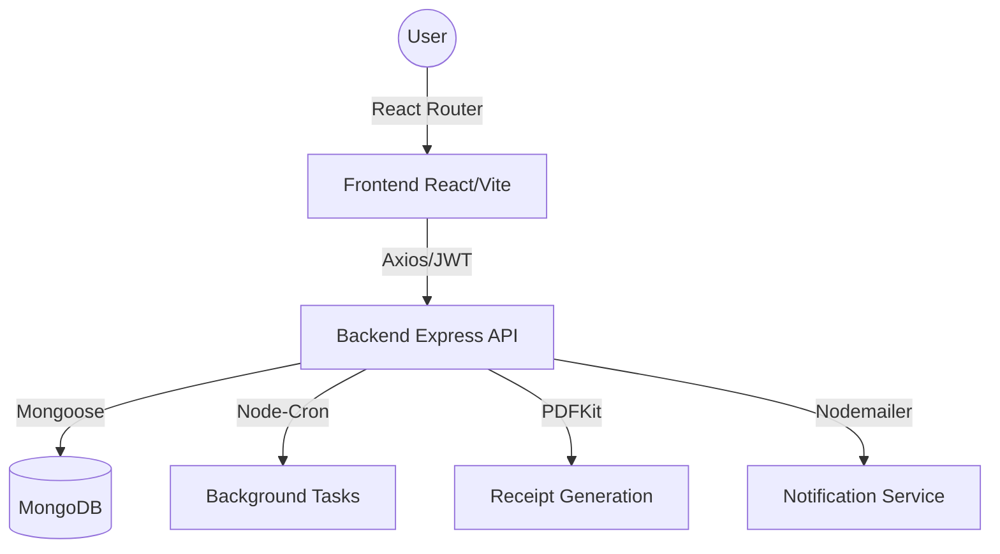

# Vehicle Service Booking System (VSBS)

A comprehensive Vehicle Service Booking application built with the MERN stack (MongoDB, Express.js, React.js, Node.js). The platform allows users to browse service offerings, book vehicle service appointments, and receive automated notifications and PDF receipts.

## 🛠 Technologies Used

### Frontend
- **Framework:** React (v19) with Vite
- **Styling:** Tailwind CSS (v4)
- **Routing:** React Router v7
- **Icons:** Lucide React
- **Date Handling:** Date-FNS
- **HTTP Client:** Axios

### Backend
- **Core:** Node.js & Express.js
- **Database:** MongoDB with Mongoose ODM
- **Authentication:** JWT (`jsonwebtoken`) & `bcryptjs`
- **PDF Generation:** PDFKit & Puppeteer
- **Task Scheduling:** Node-Cron
- **Email Service:** Nodemailer
- **Template Engine:** EJS

## 📁 Project Structure

```text
Vehicle_App/Project/
├── backend/            # Express REST API, MongoDB models, jobs, templates
│   ├── controllers/    # Request handlers
│   ├── models/         # Mongoose schemas (User, Booking, Service)
│   ├── routes/         # Express routes
│   └── server.js       # Main entry point
└── frontend/           # React application
    ├── src/            # Components, pages, and context
    └── public/         # Static assets
```

## 🏗 System Architecture



## 🚀 Getting Started

### Prerequisites
- [Node.js](https://nodejs.org/en/) installed on your local machine
- [MongoDB](https://www.mongodb.com/) running locally or via MongoDB Atlas

### Backend Setup

1. Navigate to the backend directory:
   ```bash
   cd backend
   ```
2. Install the required dependencies:
   ```bash
   npm install
   ```
3. Set up environment variables. Create a `.env` file in the `backend` directory based on the following template:
   ```env
   PORT=5000
   MONGO_URI=your_mongodb_connection_string
   JWT_SECRET=your_jwt_secret
   # Email credentials for nodemailer
   EMAIL_USER=your_email@example.com
   EMAIL_PASS=your_email_password
   ```
4. Start the backend development server:
   ```bash
   npm run dev
   ```

### Frontend Setup

1. Open a new terminal instance and navigate to the frontend directory:
   ```bash
   cd frontend
   ```
2. Install the required dependencies:
   ```bash
   npm install
   ```
3. Create a `.env` file in the `frontend` directory with your backend API URL:
   ```env
   VITE_API_BASE_URL=http://localhost:5000/api
   ```
4. Start the frontend development server:
   ```bash
   npm run dev
   ```

## ✨ Key Features
- **User Authentication:** Secure signup and login flows for users.
- **Service Catalog:** View available vehicle services.
- **Booking System:** Interactive calendar integration to book service dates.
- **Automated Tasks:** Cron jobs running in the background for scheduled operations.
- **Receipt Generation:** Automatically create PDF receipts for successful bookings.
- **Email Alerts:** Notifications sent to users for booking updates and confirmations.

## 🗺️ Roadmap & Future Enhancements

### Phase 1: AI & Automation
- [ ] **Predictive Maintenance:** Integrate an ML model to suggest service intervals based on driving patterns.
- [ ] **WhatsApp Integration:** Automated service reminders and status updates via WhatsApp Business API.

### Phase 2: User Experience
- [ ] **Real-time Tracking:** Live GPS tracking of mobile mechanics for "Home Service" bookings.
- [ ] **Payment Gateway:** Integration with Stripe/Razorpay for secure, in-app digital payments.

### Phase 3: Engineering Excellence
- [ ] **TypeScript:** Complete migration to TypeScript for enhanced type safety.
- [ ] **Unit Testing:** Achieve 80%+ test coverage with Jest and Supertest.
- [ ] **Mobile App:** Build a cross-platform mobile application using React Native.

## 📄 License
This project is licensed under the MIT License.
